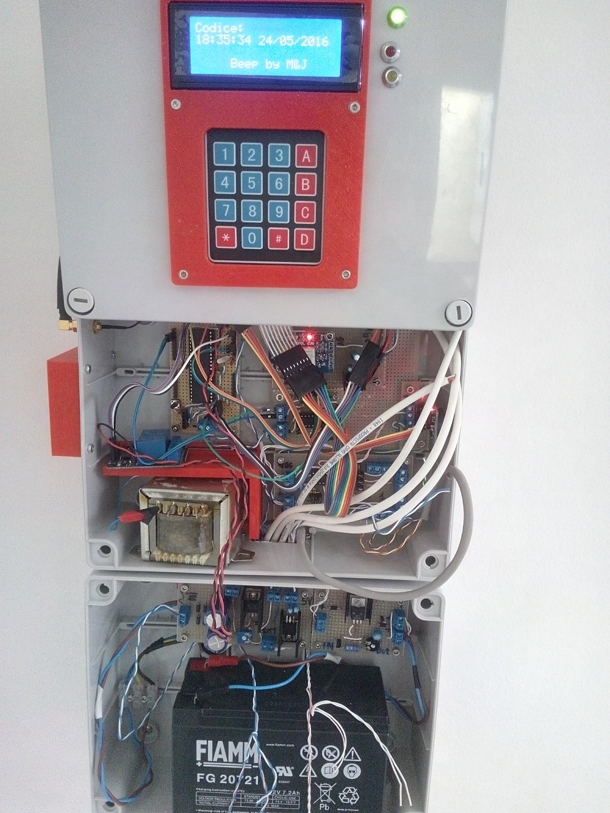

#### Working in progress !!!
# mandjBeep
## Cosa &egrave;? 
Centralina di allarme modulare pilotata da un atmega1284. 
### Storia
Il progetto &egrave; nato dall'esigenza di in stallare un sistema di allarme in casa. La prima bozza prevedeva l'uso di un atmega328, ma poi con crescere delle
funzionalit&agrave;, sono stato costretto a trovare un microcontrollore con un po di memoria in pi&ugrave;. La scelta &egrave; ricaduta su un atmega1284. Di seguito un comparazione 
tra i microcontrollori pi&ugrave; diffusi (Arduino like) 

<table>
	<tr><th>Feature</th><th>328P</th><th>1284P</th><th>2560P</th></tr>
	<tr><td>Price</td><td>$2.99</td><td>$4.66</td><td>$11.28</td></tr>
	<tr><td>RAM</td><td>2k</td><td>16k</td><td>8k</td></tr>
	<tr><td>Flash</td><td>32k</td><td>128k</td><td>256k</td></tr>
	<tr><td>EEPROM</td><td>1k</td><td>4k</td><td>4k</td></tr>
	<tr><td>UART</td><td>1</td><td>2</td><td>4</td></tr>
	<tr><td>IO Pins</td><td>23</td><td>32</td><td>86</td></tr>
	<tr><td>Interrupts</td><td>2</td><td>3</td><td>8</td></tr>
	<tr><td>Analog Inputs</td><td>6</td><td>8</td><td>16</td></tr>
</table>

### Caratteristiche:

* RTC: modulo DS3231 per la gestione del tempo
* LCD 20x4 per impostazioni/visualizzazione stato, etc (collegato ad un PCF8574 che lo rende I2C)
* tastierino 4x4 (tastierino a membrana classico x arduino collegato ad un PCF8574 che lo rende I2C)
* 2 zone (da implementare)
* avviso tramite modulo GSM (al momento solo tramite sms)
* relay per attivizione sirena.
* batteria tampone al piombo 12v 7A

## Librerie usate

* [Keypad_I2C](https://github.com/joeyoung/arduino_keypads/tree/master/Keypad_I2C): libreria per la gestione del tastierino I2C.
* [LCDMenuLib](https://github.com/Jomelo/LCDMenuLib): libreria per la gestione del menu.
* [secTimer](https://github.com/leomil72/secTimer): Simple seconds counter for Arduino boards and Atmel microcontrollers.
The library can count from 0 to (2^32)-1 seconds. This is a really HUGE
interval of time since (2^32)-1 seconds are about 136 years! So your
device will cease to function before the library will overflow!
* MandjTimer: modificato la libreria [Timer](http://playground.arduino.cc/Code/Timer) per utilizzare secTimer al posto di millis().
* [Password](http://playground.arduino.cc/Code/Password): libreria per la gestione del codice di accesso.
* [PCF8574](https://github.com/RobTillaart/Arduino/tree/master/libraries/PCF8574): libreria per la gestione dei moduli sensore, gestione dell'integrato PCF8574.
* [Rtc_by_Makuna](https://github.com/Makuna/Rtc): liberia per la gestione del modulo DS3231 pe la gestione del tempo.
* [TimerOneThree](https://github.com/heliosoph/TimerOneThree):  The arduino TimerOne library adapted for ATmega1284P and extended for timer3.
* [GSM Shield](http://www.gsmlib.org): a library developed for Arduino's shields that support SIM900/SIM908.
* [Keypad](http://playground.arduino.cc/Code/Keypad): a library for using <em>matrix</em> style keypads with the Arduino. As of version 3.0 it now supports mulitple keypresses.
* [NewLiquidCrystal](https://bitbucket.org/fmalpartida/new-liquidcrystal/wiki/Home): the <em>LCD Library</em> for <strong>Arduino</strong> and <strong>Chipkit</strong>. It is a derivate of the original LiquidCrystal Library as sourced in the Arduino SDK. It has been developed to be compatible with the current LiquidCrystal library, its performance is almost 5 times faster and fully extendable if need be.
* [SoftwareSerial](https://www.arduino.cc/en/Reference/SoftwareSerial): library has been developed to allow serial communication on other digital pins of the Arduino, using software to replicate the functionality.
* [Wire](https://www.arduino.cc/en/Reference/Wire): library allows you to communicate with I2C / TWI devices.
 
##  Author

* M&J 
* Sito: [siatienfalla](http://siatienfalla.altervista.org/)
* Data inizio: 09/02/2016
* Versione: 1.0
 
## Licence: GPL ver. 3

## Immagini

